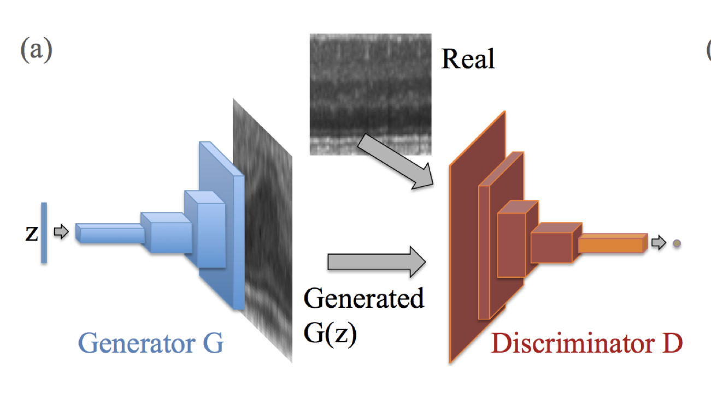
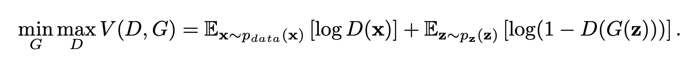

# Anomaly Detection in Cryptocurrency Markets using 1D Convolutional AnoGAN

**Detecting pump-and-dump events and other irregular market behaviors using deep learning architectures on cryptocurrency price and order-book data.**

---

## Overview

AnoGAN is a deep convolutional generative adversarial network (GAN) designed for anomaly detection. In a GAN, two networks compete in a zero-sum game:

- The **discriminator** learns to distinguish real from generated inputs (normal vs. anomalous).  
- The **generator** produces synthetic inputs to challenge the discriminator.

  

The official AnoGAN implementation uses 2D convolutional layers for image data.  

In this project, we adapt the framework for **time-series cryptocurrency order-book data**, replacing 2D convolutions with **1D convolutions** in both the generator and discriminator to better capture temporal patterns.

---

## Dataset

The dataset for this project is provided in the `data/` folder of the repository.

### Top Features

Some of the key features include:

- `bids_notional_0` – Total notional value at bid level 0  
- `asks_distance_14` – Distance metric for ask level 14  
- `bids_limit_notional_10` – Notional value of limit orders at bid level 10  
- `asks_distance_12` – Distance metric for ask level 12  
- `bids_distance_7` – Distance metric for bid level 7  
- `asks_distance_7` – Distance metric for ask level 7  
- `asks_limit_notional_7` – Notional value of limit orders at ask level 7  
- `bids_limit_notional_8` – Notional value of limit orders at bid level 8  
- `asks_distance_8` – Distance metric for ask level 8  
- `asks_distance_11` – Distance metric for ask level 11  
- `bids_distance_9` – Distance metric for bid level 9  
- `asks_distance_13` – Distance metric for ask level 13  
- `bids_distance_5` – Distance metric for bid level 5  
- `asks_distance_6` – Distance metric for ask level 6  
- `asks_notional_0` – Total notional value at ask level 0  
- `asks_limit_notional_11` – Notional value of limit orders at ask level 11  
- `asks_limit_notional_13` – Notional value of limit orders at ask level 13  
- `bids_distance_8` – Distance metric for bid level 8  
- `bids_limit_notional_7` – Notional value of limit orders at bid level 7  
- `asks_cancel_notional_13` – Cancelled notional value at ask level 13  
- `bids_distance_2` – Distance metric for bid level 2  
- `bids_distance_11` – Distance metric for bid level 11  
- `bids_market_notional_7` – Market notional value at bid level 7  
- `bids_distance_3` – Distance metric for bid level 3  
- `bids_distance_10` – Distance metric for bid level 10  
- `bids_distance_6` – Distance metric for bid level 6  
- `asks_market_notional_0` – Market notional value at ask level 0  
- `bids_distance_4` – Distance metric for bid level 4  
- `asks_limit_notional_3` – Notional value of limit orders at ask level 3  
- `asks_limit_notional_14` – Notional value of limit orders at ask level 14  

*(and more… see full dataset in the `data/` folder)*

---

## Model

A **pretrained model** is provided in the `models/` folder for reference. We recommend training the model on your own dataset for best results.

---

## License

This project is licensed under the **MIT License**.

---

## References

- Schlegl, T., Seeböck, P., Waldstein, S. M., Schmidt‑Erfurth, U., & Langs, G. (2017). *Unsupervised Anomaly Detection with Generative Adversarial Networks to Guide Marker Discovery.* arXiv:1703.05921. Available: [https://arxiv.org/pdf/1703.05921.pdf](https://arxiv.org/pdf/1703.05921.pdf)  
- Lee, S. (2018). *AnoGAN‑PyTorch.* GitHub repository. Available: [https://github.com/seungjunlee96/AnoGAN-pytorch/](https://github.com/seungjunlee96/AnoGAN-pytorch/)
