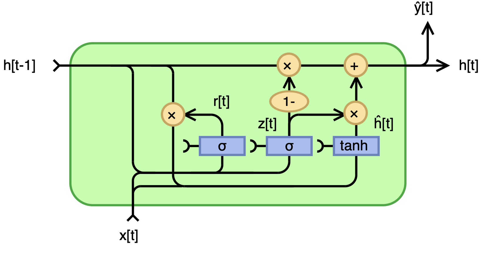
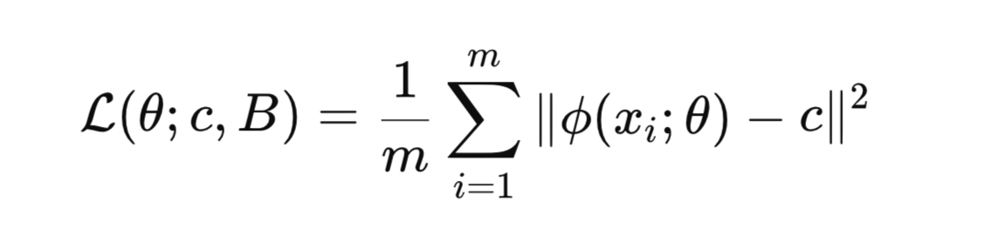

# GRU-with-Deep-SVDD-Loss-for-Anomaly-Detection-in-Cryptocurrencies

## Overview
This repository implements a GRU-based Deep Support Vector Data Description (Deep SVDD) model for unsupervised anomaly detection in sequential data. The approach combines the temporal modeling capabilities of Gated Recurrent Units with the powerful one-class classification framework of Deep SVDD.

## GRU Architecture

The Gated Recurrent Unit (GRU) is a recurrent neural network that captures temporal dependencies efficiently by updating hidden states at each time step.

### Key Components:
- **Update Gate (Zₜ)**: Determines how much information from the previous hidden state should be retained
- **Reset Gate (Rₜ)**: Controls how much of the past hidden state should be forgotten

Unlike LSTM, GRU does not maintain a separate cell state for long-term memory, making it computationally more efficient.

### Mathematical Formulation:
- **Zₜ** = σ(Wᵩ · [hₜ₋₁, xₜ]) - Update gate
- **Rₜ** = σ(Wᵣ · [hₜ₋₁, xₜ]) - Reset gate  
- **ĥₜ** = tanh(W · [Rₜ ⊙ hₜ₋₁, xₜ]) - Candidate hidden state
- **hₜ** = (1 - Zₜ) ⊙ hₜ₋₁ + Zₜ ⊙ ĥₜ - Final hidden state

## Deep SVDD Framework

We extend the Deep SVDD framework (Ruff et al., 2018) with a two-step optimization procedure:

### Method:
1. **GRU Encoder**: Maps input sequences to compact embeddings in latent space
2. **Hypersphere Learning**: Iteratively updates both encoder parameters and hypersphere center

Unlike standard Deep SVDD with fixed center, we employ a dedicated center learning rate (ηc) to adaptively refine the hypersphere center after each batch, enabling better feature space alignment during training.

### Optimization Steps:
1. Compute embeddings and minimize mean squared distance to current center c

2. Update center c towards the mean of current embeddings

## Results

### PCA Visualization:
- Each point represents a sequence's embedding projected from high dimensions to 2D
- Normal points form compact clusters around the center
- Anomalies scatter outside the decision boundary

### Performance Considerations:
- Higher embedding dimensions capture more variance but risk overfitting
- Semi-supervised approaches for better data representation can be beneficial

## References
Ruff et al. (2018). "Deep Support Vector Data Description for Unsupervised and Semi-Supervised Anomaly Detection"

